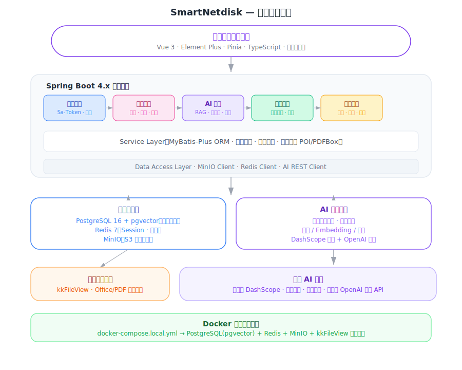
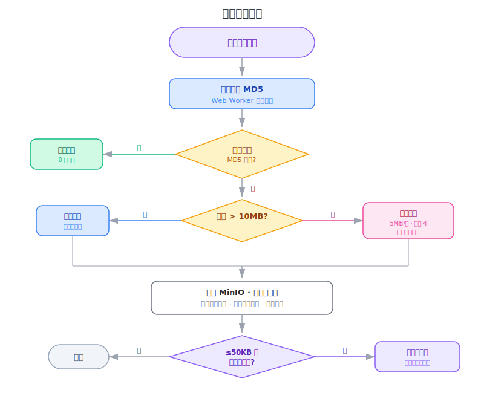
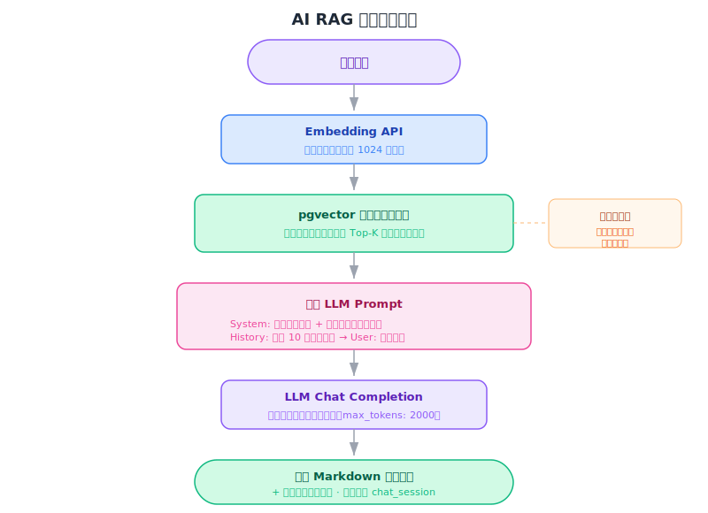
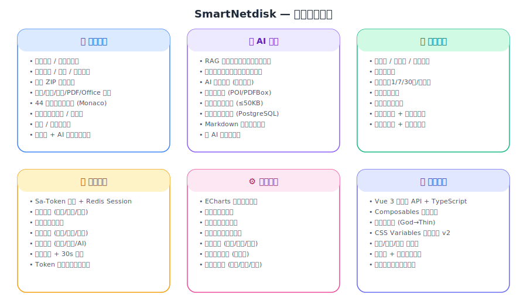

# SmartNetdisk - AI 智能云存储系统

<p align="center">
  <b>一个集成 AI 语义搜索和 RAG 问答能力的私有云存储系统</b>
</p>

<p align="center">
  
  
  
  
  
  
</p>

---

## 项目简介

SmartNetdisk 是一个功能完整的私有云存储系统，除了提供文件上传、下载、分享等基础网盘功能外，还深度集成了 AI 能力：

- **语义搜索**：通过自然语言描述查找文件，而非仅靠文件名匹配
- **RAG 智能问答**：基于已上传的文档内容回答问题，支持多文档知识库
- **AI 文件摘要**：一键生成文件摘要，鼠标悬停即可查看
- **智能向量化**：上传后自动对小文件进行向量化处理

---

## 系统架构

<p align="center">
  
</p>

```
┌──────────────────────────────────────────────────────────────────┐
│                         客户端 (Browser)                         │
│  ┌──────────┐  ┌──────────┐  ┌──────────┐  ┌────────────────┐  │
│  │ 文件管理  │  │ AI 助手  │  │ 分享页面  │  │  管理后台      │  │
│  │ Vue 3    │  │ ECharts  │  │ 公开访问  │  │  用户/文件管理  │  │
│  └────┬─────┘  └────┬─────┘  └────┬─────┘  └───────┬────────┘  │
│       └──────────────┴─────────────┴────────────────┘           │
│                         Axios HTTP                               │
└──────────────────────────┬───────────────────────────────────────┘
                           │ REST API
┌──────────────────────────┴───────────────────────────────────────┐
│                    Spring Boot 4.x (JDK 21)                      │
│                                                                   │
│  ┌─────────┐ ┌──────────┐ ┌──────────┐ ┌──────────┐ ┌────────┐ │
│  │ Auth    │ │ File     │ │ AI       │ │ Share    │ │ Admin  │ │
│  │Controller│ │Controller│ │Controller│ │Controller│ │Controller│ │
│  └────┬────┘ └────┬─────┘ └────┬─────┘ └────┬─────┘ └───┬────┘ │
│       └───────────┴────────────┴─────────────┴───────────┘      │
│                        Service Layer                             │
│  ┌──────────────────────────────────────────────────────────┐   │
│  │  Sa-Token 认证  │  文件服务  │  AI 服务  │  通知服务     │   │
│  └──────────────────────────────────────────────────────────┘   │
│                        Data Layer                                │
│  ┌──────────┐ ┌──────────┐ ┌──────────┐ ┌──────────────────┐   │
│  │MyBatis-  │ │ MinIO    │ │ Redis    │ │ AI Provider      │   │
│  │Plus ORM  │ │ Client   │ │ Client   │ │ (REST Client)    │   │
│  └────┬─────┘ └────┬─────┘ └────┬─────┘ └───────┬──────────┘   │
└───────┼─────────────┼────────────┼───────────────┼──────────────┘
        │             │            │               │
┌───────┴──┐  ┌───────┴──┐  ┌─────┴───┐  ┌───────┴──────────────┐
│PostgreSQL│  │  MinIO   │  │  Redis  │  │  AI API Provider     │
│ 16 +     │  │  Object  │  │    7    │  │  ┌────────────────┐  │
│ pgvector │  │  Storage │  │ Session │  │  │ 阿里云DashScope│  │
│          │  │          │  │  Store  │  │  │ 火山引擎       │  │
│ 用户数据  │  │ 文件存储  │  │         │  │  │ 硅基流动       │  │
│ 文件元数据│  │ 头像存储  │  │         │  │  │ ...            │  │
│ 向量索引  │  │          │  │         │  │  └────────────────┘  │
│ AI 会话  │  │          │  │         │  │                      │
└──────────┘  └──────────┘  └─────────┘  └──────────────────────┘
```

---

## 核心流程

### 文件上传流程

<p align="center">
  
</p>

<details>
<summary>查看文字版流程</summary>

```
用户选择文件
    │
    ▼
┌──────────────┐     ┌──────────────┐
│ 计算文件 MD5  │────▶│ 秒传检测      │
└──────────────┘     │ (MD5 匹配?)  │
                     └──────┬───────┘
                    是 │         │ 否
                       ▼         ▼
              ┌──────────┐  ┌──────────────┐
              │ 秒传完成  │  │ 文件 > 10MB? │
              │ (0秒上传) │  └──────┬───────┘
              └──────────┘    否 │       │ 是
                                 ▼       ▼
                        ┌─────────┐ ┌──────────────┐
                        │ 普通上传 │ │ 分片上传      │
                        │ (整文件) │ │ (5MB/片,并发4)│
                        └────┬────┘ │ 断点续传支持  │
                             │      └──────┬───────┘
                             └──────┬──────┘
                                    ▼
                          ┌──────────────────┐
                          │ 存入 MinIO       │
                          │ 更新文件元数据    │
                          │ 更新用户空间      │
                          └────────┬─────────┘
                                   ▼
                          ┌──────────────────┐
                          │ 文件≤50KB 且      │
                          │ 支持向量化?       │
                          └──────┬───────────┘
                           是 │       │ 否
                              ▼       ▼
                    ┌──────────────┐  完成
                    │ 异步向量化    │
                    │ (事务提交后)  │
                    └──────────────┘
```


</details>

### AI RAG 问答流程

<p align="center">
  
</p>

<details>
<summary>查看文字版流程</summary>

```
用户提问
    │
    ▼
┌──────────────────┐
│ Embedding API    │
│ 将问题转为向量    │
└────────┬─────────┘
         │
         ▼
┌──────────────────┐
│ pgvector 搜索    │
│ 余弦相似度匹配    │
│ 返回 Top-K 文档块 │
└────────┬─────────┘
         │
         ▼
┌──────────────────┐
│ 构建 Prompt      │
│ System: 文档上下文│
│ History: 对话历史 │
│ User: 用户问题    │
└────────┬─────────┘
         │
         ▼
┌──────────────────┐
│ LLM Chat API    │
│ 生成回答         │
└────────┬─────────┘
         │
         ▼
┌──────────────────┐
│ 返回回答          │
│ + 引用来源文件    │
│ + Markdown 渲染   │
└──────────────────┘
```


</details>

### 文件向量化流程

<details>
<summary>查看文字版流程</summary>

```
触发向量化 (手动/自动)
    │
    ▼
┌──────────────────┐
│ 从 MinIO 下载文件 │
└────────┬─────────┘
         │
         ▼
┌──────────────────┐
│ 文本提取          │
│ ├─ .txt/.md → 直接读取    │
│ ├─ .docx → Apache POI     │
│ ├─ .doc  → POI Scratchpad │
│ └─ .pdf  → PDFBox         │
└────────┬─────────┘
         │
         ▼
┌──────────────────┐
│ 文本分块          │
│ 2000 字/块       │
│ 200 字重叠       │
└────────┬─────────┘
         │
         ▼
┌──────────────────┐
│ 批量 Embedding   │
│ 每批 16 个块     │
│ 1024 维向量      │
└────────┬─────────┘
         │
         ▼
┌──────────────────┐
│ 存入 pgvector    │
│ 更新向量化状态    │
│ 发送完成通知      │
└──────────────────┘
```

---


</details>

---

## 功能特性总览

<p align="center">
  
</p>

<details>
<summary>查看文字版</summary>

```
SmartNetdisk 功能矩阵
│
├─ 文件管理
│  ├─ 上传：拖拽 / 文件夹 / 分片 / 秒传 / 断点续传
│  ├─ 下载：单文件 / 批量 ZIP 打包
│  ├─ 预览：图片(缩放旋转画廊) / 视频 / 音频 / PDF / Office / 代码 / Markdown
│  ├─ 编辑：44 种文件格式在线编辑 (Monaco Editor)
│  ├─ 组织：文件夹 / 移动 / 复制 / 重命名 / 递归删除
│  ├─ 回收站：软删除 / 恢复 / 彻底删除 / 清空
│  └─ 搜索：文件名 + AI 摘要联合匹配
│
├─ AI 智能
│  ├─ 全局问答：基于全部文件的 RAG 对话
│  ├─ 知识库：选择指定文件限定范围对话
│  ├─ AI 摘要：一键生成 / tooltip 展示 / 持久化
│  ├─ 智能分析：文本提取 + 分块 + 向量化
│  ├─ 自动向量化：≤50KB 文件上传后自动处理
│  ├─ 历史会话：PostgreSQL 持久化 / 多会话管理
│  ├─ Markdown：AI 回答完整渲染
│  └─ 多模型：阿里云 / 火山引擎 / 硅基流动
│
├─ 分享系统
│  ├─ 类型：单文件 / 文件夹 / 批量
│  ├─ 保护：提取码 / 有效期 / 访问次数
│  ├─ 预览：分享页直接在线预览
│  └─ 展示：分享者头像 + 用户名
│
├─ 用户系统
│  ├─ 认证：Sa-Token + Redis Session
│  ├─ 个人中心：头像 / 用户名 / 密码
│  ├─ 存储管理：仪表盘展示
│  ├─ 系统设置：主题 / 偏好
│  └─ 通知：实时通知 / 未读徽标
│
└─ 管理后台 (Admin)
   ├─ 数据概览：ECharts 图表 (趋势/分布/排行)
   ├─ 用户管理：搜索 / 启禁用 / 配额 / 角色
   └─ 文件管理：全局搜索 / 多维度筛选
```

</details>

---

## 技术栈

### 后端
| 技术 | 说明 |
|------|------|
| Spring Boot 4.x | 核心框架 |
| JDK 21 | Java 运行时（Text Blocks、Pattern Matching、Virtual Threads） |
| MyBatis-Plus | ORM 框架（代码生成、分页插件） |
| Sa-Token | 轻量级认证鉴权（角色权限、Redis Session） |
| PostgreSQL 16 + pgvector | 关系数据库 + 向量相似度搜索 |
| Redis 7 | Session 存储 + 缓存 |
| MinIO | S3 兼容对象存储 |
| Apache POI 5.3 | Word（docx/doc）文本提取 |
| Apache PDFBox 3.0 | PDF 文本提取 |
| kkFileView | Office/文档在线预览服务 |

### 前端
| 技术 | 说明 |
|------|------|
| Vue 3 + TypeScript | 组合式 API + 类型安全 |
| Vite | 极速开发构建 |
| Element Plus | 企业级 UI 组件库 |
| Pinia | 下一代状态管理 |
| ECharts | 数据可视化（管理后台） |
| Uppy | 模块化文件上传（分片/秒传/断点续传） |
| Monaco Editor | VS Code 同款代码编辑器 |
| marked | Markdown → HTML 渲染 |

### AI 能力
| 能力 | 说明 |
|------|------|
| 对话/摘要/RAG | 支持任意 OpenAI 兼容 API（阿里云、火山引擎、硅基流动等） |
| 文本向量化 | 多种 Embedding 模型（bge-large-zh、text-embedding-v3、doubao-embedding 等） |
| 向量存储 | PostgreSQL pgvector（余弦相似度、IVFFlat/HNSW 索引） |

---

## 数据库 ER 关系

```
┌─────────────┐     ┌──────────────┐     ┌──────────────┐
│  sys_user    │     │  file_info   │     │   folder     │
├─────────────┤     ├──────────────┤     ├──────────────┤
│ id          │◄──┐ │ id           │     │ id           │
│ username    │   │ │ user_id ─────│─────│ user_id      │
│ email       │   │ │ folder_id ───│────▶│ parent_id    │
│ password    │   │ │ file_name    │     │ folder_name  │
│ avatar      │   │ │ file_md5     │     │ deleted      │
│ role        │   │ │ file_size    │     │ delete_time  │
│ used_space  │   │ │ file_type    │     └──────────────┘
│ total_space │   │ │ storage_path │
│ status      │   │ │ ai_summary   │     ┌──────────────┐
└─────────────┘   │ │ is_vectorized│     │vector_document│
                  │ │ last_access  │     ├──────────────┤
                  │ │ deleted      │     │ id           │
                  │ └──────────────┘     │ file_id ─────│──▶ file_info
                  │                      │ user_id      │
                  │ ┌──────────────┐     │ chunk_index  │
                  │ │    share     │     │ content      │
                  │ ├──────────────┤     │ embedding    │◄── pgvector(1024)
                  │ │ id           │     │ token_count  │
                  └─│ user_id      │     └──────────────┘
                    │ file_id      │
                    │ share_code   │     ┌──────────────┐
                    │ password     │     │ notification │
                    │ share_type   │     ├──────────────┤
                    │ expire_time  │     │ id           │
                    │ view_count   │     │ user_id      │
                    └──────────────┘     │ type         │
                                         │ title        │
                  ┌──────────────┐       │ content      │
                  │ chat_session │       │ is_read      │
                  ├──────────────┤       └──────────────┘
                  │ id           │
                  │ user_id      │       ┌──────────────┐
                  │ title        │       │  file_chunk  │
                  │ mode         │       ├──────────────┤
                  │ messages     │◄─JSON │ id           │
                  │ scoped_files │◄─JSON │ file_md5     │
                  └──────────────┘       │ chunk_index  │
                                         │ chunk_path   │
                                         └──────────────┘
```

---

## 前端组件架构

```
App.vue
├─ BasicLayout.vue ─────────────────────────────────┐
│  ├─ Sidebar ──────────────────────┐               │
│  │  ├─ Logo                       │               │
│  │  ├─ NavigationMenu             │   ┌───────────┤
│  │  │  ├─ 全部文件                │   │  Header   │
│  │  │  ├─ 最近访问                │   │  ├─ Search│
│  │  │  ├─ 相册                    │   │  ├─ Theme │
│  │  │  ├─ 我的分享                │   │  ├─ Notify│
│  │  │  ├─ 回收站                  │   │  ├─ Settings│
│  │  │  └─ 管理后台 (admin only)   │   │  └─ User  │
│  │  └─ StorageInfo                │   └───────────┤
│  │                                │               │
│  ├─ MainContent ──────────────────┤               │
│  │  └─ <router-view> ────────────┤               │
│  │     ├─ FileMain.vue            │               │
│  │     │  ├─ FileToolbar          │               │
│  │     │  ├─ FileListView (table) │               │
│  │     │  ├─ FileGridView (cards) │               │
│  │     │  ├─ FileContextMenu      │               │
│  │     │  ├─ FilePreviewDialog    │               │
│  │     │  ├─ FileEditorDialog     │               │
│  │     │  └─ ShareBatchDialog     │               │
│  │     ├─ ProfileView.vue         │               │
│  │     ├─ SettingsView.vue        │               │
│  │     ├─ AdminDashboard.vue      │               │
│  │     └─ MySharesView.vue        │               │
│  │                                │               │
│  └─ AiSidebar.vue ───────────────┘               │
│     ├─ ModeToggle (全局问答 / 指定文件)           │
│     ├─ HistoryPanel (会话管理)                    │
│     ├─ FilePicker (知识库文件选择)                │
│     ├─ ChatArea (Markdown 渲染消息)               │
│     └─ InputArea                                  │
│                                                    │
├─ LoginView.vue                                     │
├─ RegisterView.vue                                  │
└─ ShareView.vue (公开分享页，独立布局)              │
```

---

## Composables 架构

```
composables/
├─ useFileList.ts ──────── 文件列表加载、分页、排序、搜索、路由监听
├─ useFileSelection.ts ─── 单选、多选、Shift 范围选、全选
├─ useFileOperations.ts ── 所有文件 CRUD + 对话框状态 + AI 操作
├─ useContextMenu.ts ───── 右键菜单定位、边界检测、显隐
├─ useTheme.ts ─────────── 主题切换（浅色/暗色/跟随系统）
├─ useSidebar.ts ───────── 侧边栏折叠、移动端抽屉
└─ useMediaQuery.ts ────── 响应式断点检测
```

---

## 项目结构

```
SmartNetdisk/
├── src/main/java/com/wmt/smartnetdisk/
│   ├── config/            # Sa-Token、MinIO、AI、CORS、kkFileView、StpInterface
│   ├── controller/        # 10 个 REST 控制器
│   ├── service/impl/      # 业务逻辑实现
│   ├── entity/            # 8 个数据库实体
│   ├── mapper/            # MyBatis-Plus Mapper（含原生 SQL）
│   ├── dto/request/       # 请求 DTO（参数校验）
│   ├── vo/                # 响应 VO（视图对象）
│   ├── common/            # Result 封装、全局异常处理、枚举、常量
│   └── utils/             # MinioUtils（上传/下载/预签名 URL）
│
├── SmartNetdiskFrontend/src/
│   ├── api/               # 7 个 API 模块
│   ├── components/        # 可复用组件
│   ├── composables/       # 7 个 Vue Composables
│   ├── constants/         # 文件类型注册表
│   ├── layout/            # BasicLayout
│   ├── stores/            # Pinia 用户状态
│   ├── styles/            # 设计系统 v2.0
│   └── views/             # 页面组件
│
├── docker-compose.local.yml   # PostgreSQL + Redis + MinIO + kkFileView
├── docker/init-db/            # 数据库初始化
├── src/main/resources/db/migration/  # V2-V8 增量迁移
└── start-local.sh             # 一键启动脚本
```

---

## 快速开始

### 环境要求

- JDK 21+
- Node.js 18+
- Docker Desktop
- Maven 3.9+

### 1. 启动基础服务

```bash
bash start-local.sh up
```

| 服务 | 地址 | 账号/密码 |
|------|------|----------|
| PostgreSQL (pgvector) | localhost:5433 | postgres / postgres123 |
| Redis | localhost:6381 | redis123 |
| MinIO API | localhost:9010 | minioadmin / minioadmin123 |
| MinIO 控制台 | localhost:9011 | minioadmin / minioadmin123 |
| kkFileView | localhost:8012 | - |

### 2. 启动后端

```bash
mvn clean spring-boot:run -Dspring-boot.run.profiles=local
```

### 3. 启动前端

```bash
cd SmartNetdiskFrontend && npm install && npm run dev
```

### 4. 访问

浏览器打开 http://localhost:5173 ，注册 `admin` 账号自动获得管理员权限。

---

## 环境变量

```bash
# 数据库
DB_HOST=localhost  DB_PORT=5432  DB_PASSWORD=your_password

# Redis
REDIS_HOST=localhost  REDIS_PASSWORD=your_password

# MinIO
MINIO_ENDPOINT=http://localhost:9000
MINIO_ACCESS_KEY=your_key  MINIO_SECRET_KEY=your_secret

# AI（任意 OpenAI 兼容 API）
AI_API_KEY=your_api_key
AI_BASE_URL=https://dashscope.aliyuncs.com/compatible-mode/v1
AI_MODEL=qwen-plus

# Embedding（可选，留空则与 AI 共用）
EMBEDDING_MODEL=text-embedding-v3
EMBEDDING_BASE_URL=   EMBEDDING_API_KEY=
```

---

## 数据库迁移

| 版本 | 说明 |
|------|------|
| schema.sql | 初始表结构（用户、文件、文件夹、分片、分享、向量文档） |
| V2 | 批量分享（share_item 表 + share 扩展字段） |
| V3 | 文件夹 delete_time |
| V4 | 文件 last_access_time + 索引 |
| V5 | notification 通知表 |
| V6 | file_info.ai_summary |
| V7 | chat_session AI 会话表 |
| V8 | sys_user.role 角色字段 |

---

## API 概览

### 认证
| 方法 | 路径 | 说明 |
|------|------|------|
| POST | `/auth/register` | 注册 |
| POST | `/auth/login` | 登录 |

### 文件
| 方法 | 路径 | 说明 |
|------|------|------|
| GET | `/file/list` | 文件列表（分页+排序+筛选） |
| GET | `/file/recent` | 最近访问 |
| POST | `/file/upload` | 普通上传 |
| POST | `/file/chunk` | 分片上传 |
| POST | `/file/merge` | 合并分片 |
| GET | `/file/{id}/stream` | 流式传输（Range） |
| GET | `/file/{id}/preview` | kkFileView 预览 URL |
| POST | `/file/batch/download` | 批量 ZIP 下载 |

### AI
| 方法 | 路径 | 说明 |
|------|------|------|
| POST | `/ai/vectorize/{fileId}` | 文件向量化 |
| POST | `/ai/search` | 语义搜索 |
| POST | `/ai/chat` | RAG 问答 |
| POST | `/ai/summary/{fileId}` | 生成 AI 摘要 |

### 分享（公开）
| 方法 | 路径 | 说明 |
|------|------|------|
| GET | `/s/{code}` | 获取分享信息 |
| GET | `/s/{code}/preview/{fileId}` | 分享文件预览 |
| GET | `/s/{code}/stream/{fileId}` | 分享文件流式传输 |

### 管理后台
| 方法 | 路径 | 说明 |
|------|------|------|
| GET | `/admin/stats` | 系统统计 |
| GET | `/admin/users` | 用户列表 |
| PUT | `/admin/users/{id}/status` | 启用/禁用 |
| PUT | `/admin/users/{id}/space` | 调整配额 |
| GET | `/admin/files` | 全局文件列表 |

统一响应格式：`{ "code": 200, "message": "success", "data": { ... } }`

认证方式：请求头 `satoken: <token_value>`

---

## 开源协议

MIT License

## 致谢

- [Spring Boot](https://spring.io/projects/spring-boot) | [Vue.js](https://vuejs.org/) | [Element Plus](https://element-plus.org/)
- [Sa-Token](https://sa-token.cc/) | [MyBatis-Plus](https://baomidou.com/) | [pgvector](https://github.com/pgvector/pgvector)
- [MinIO](https://min.io/) | [kkFileView](https://kkfileview.keking.cn/)
- [Apache POI](https://poi.apache.org/) | [Apache PDFBox](https://pdfbox.apache.org/)
- [ECharts](https://echarts.apache.org/) | [Uppy](https://uppy.io/) | [Monaco Editor](https://microsoft.github.io/monaco-editor/)
