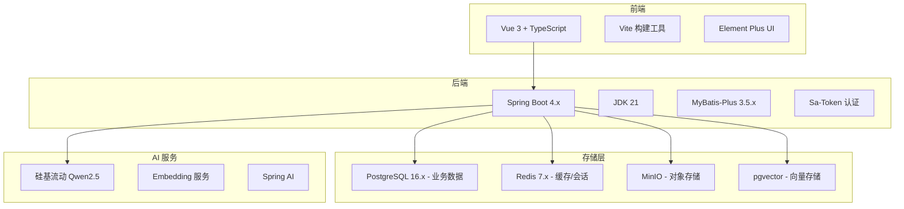
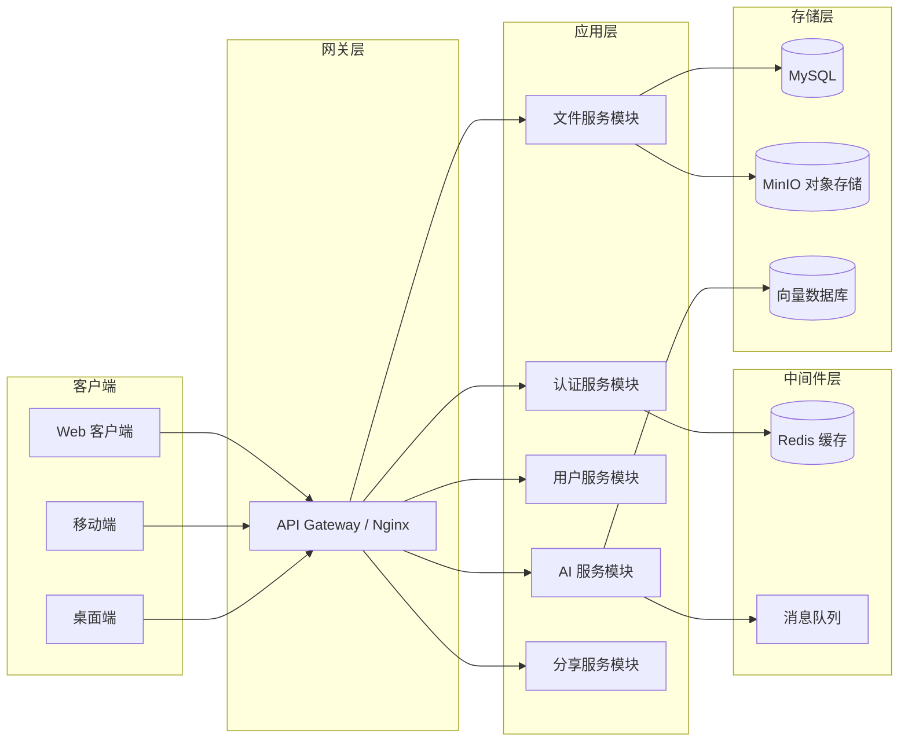
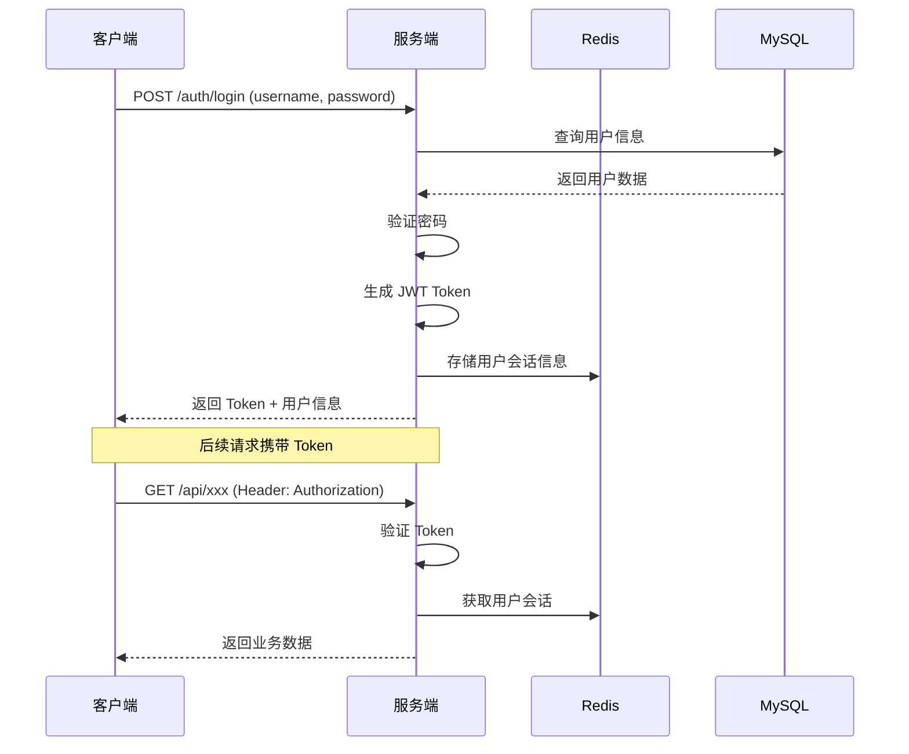
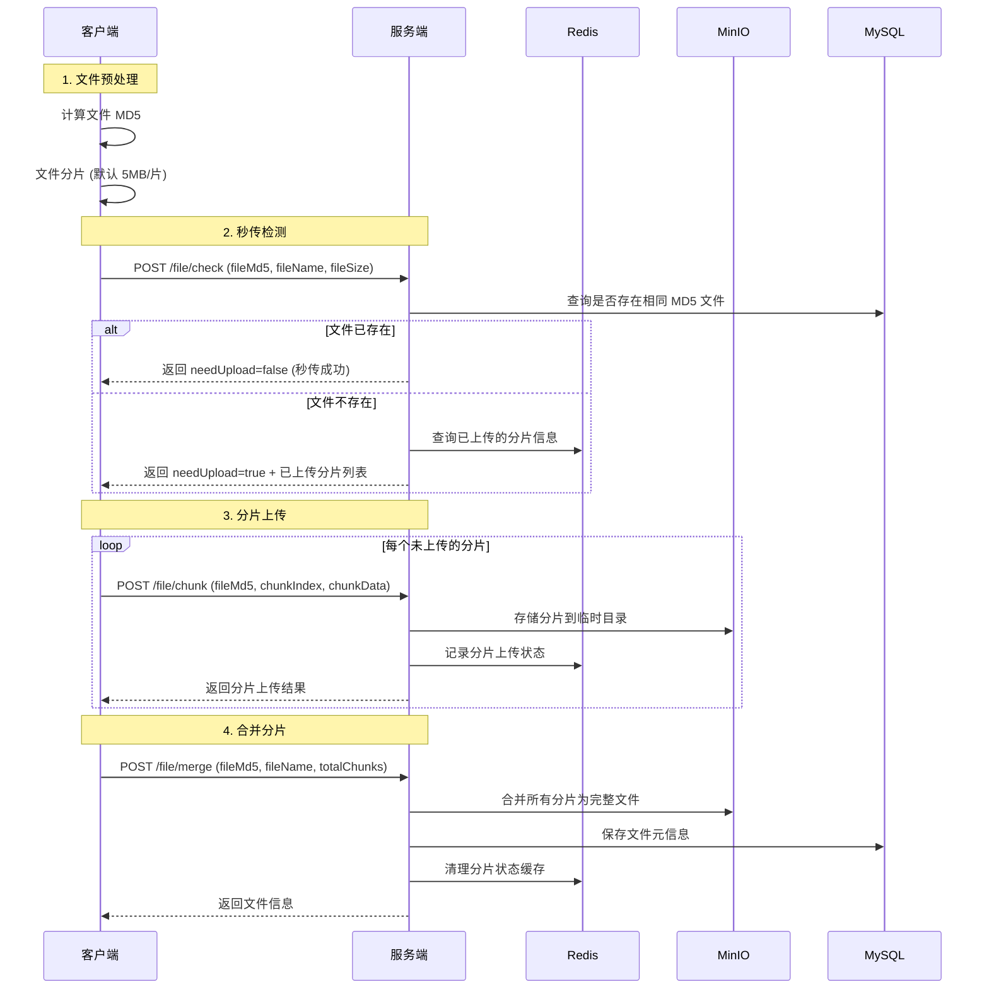
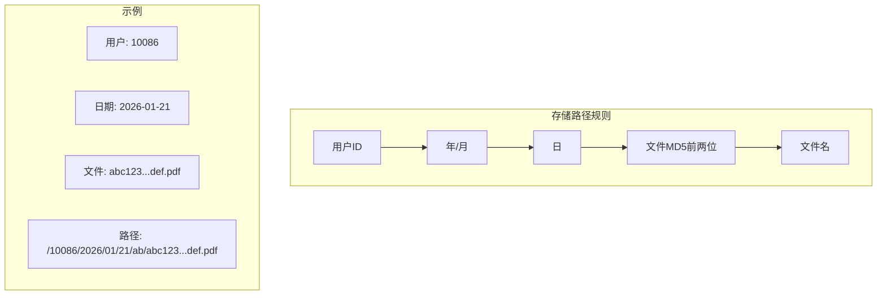
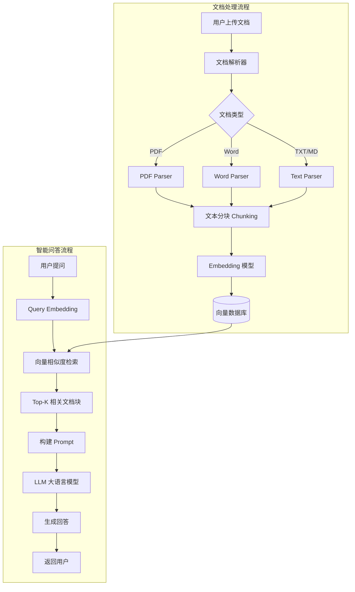
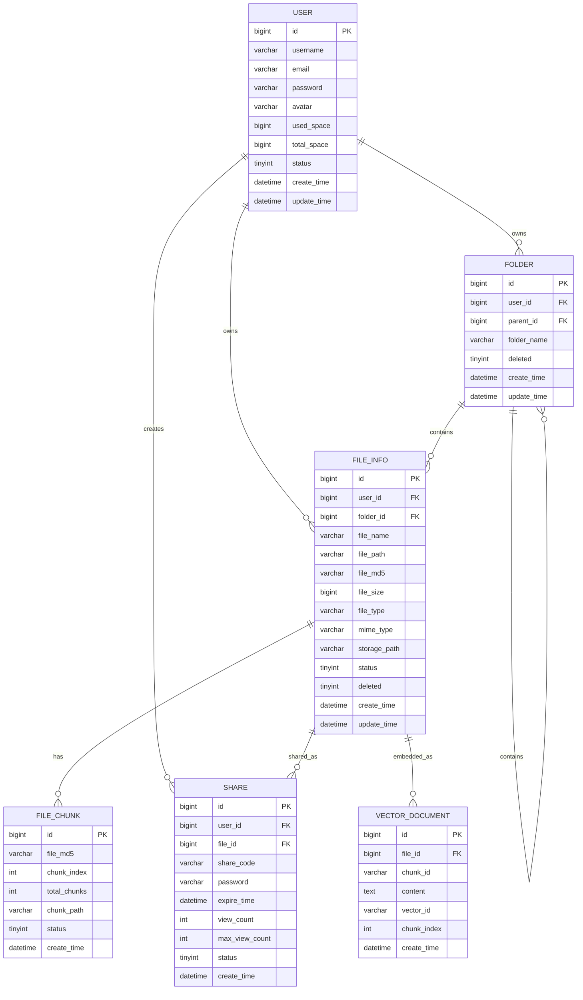

# SmartNetdisk - 智能网盘项目设计文档

> **版本**: v1.1.0  
> **创建日期**: 2026-01-21  
> **更新日期**: 2026-01-21  
> **技术栈**: Spring Boot 4.x + JDK 21 + PostgreSQL 16.x + pgvector + Redis 7.x + MinIO + MyBatis-Plus 3.5.x + Vue 3

---

## 一、项目概述

### 1.1 项目背景

SmartNetdisk（智能网盘）是一个私有化、高性能、智能化的个人云存储系统。区别于传统网盘，本项目深度集成 AI 能力，支持对文档进行**语义搜索**和**智能问答（RAG）**，并具备**极速秒传**、**分片上传**、**断点续传**等企业级文件传输特性。

### 1.2 核心目标

| 目标 | 描述 |
|------|------|
| **私有化部署** | 支持个人或企业私有部署，数据完全自主可控 |
| **高性能传输** | 分片上传、断点续传、秒传，大文件上传无压力 |
| **智能检索** | 基于向量数据库的语义搜索，告别传统关键词搜索 |
| **AI 问答（RAG）** | 对文档内容进行智能问答，快速获取关键信息 |
| **多端访问** | 支持 Web、移动端多平台访问 |

### 1.3 技术选型

| 层级 | 技术 | 版本 | 说明 |
|------|------|------|------|
| **前端** | Vue 3 + TypeScript | 3.x | SPA 单页应用 |
| | Vite | 5.x | 构建工具 |
| | Element Plus | 2.x | UI 组件库 |
| **后端** | Spring Boot | 4.x | 核心框架 |
| | JDK | 21 | LTS 版本 |
| | MyBatis-Plus | 3.5.x | ORM 框架 |
| | Sa-Token | 1.x | 认证授权 |
| **数据库** | PostgreSQL | 16.x | 主数据库 |
| | pgvector | 0.7.x | 向量存储扩展 |
| | Redis | 7.x | 缓存/会话 |
| **存储** | MinIO | 最新版 | 对象存储 |
| **AI** | 硅基流动 Qwen2.5 | - | LLM 大模型 |
| | Spring AI | 1.x | AI 框架整合 |



---

## 二、系统架构设计

### 2.1 整体架构



### 2.2 项目包结构

```
com.wmt.smartnetdisk
├── config/                     # 配置类
│   ├── MybatisPlusConfig.java
│   ├── RedisConfig.java
│   ├── MinioConfig.java
│   ├── SecurityConfig.java
│   └── AiConfig.java
├── controller/                 # 控制器层
│   ├── AuthController.java
│   ├── UserController.java
│   ├── FileController.java
│   ├── FolderController.java
│   ├── ShareController.java
│   └── AiController.java
├── service/                    # 业务逻辑层
│   ├── IAuthService.java
│   ├── IUserService.java
│   ├── IFileService.java
│   ├── IFolderService.java
│   ├── IShareService.java
│   ├── IAiService.java
│   └── impl/
│       ├── AuthServiceImpl.java
│       ├── UserServiceImpl.java
│       ├── FileServiceImpl.java
│       ├── FolderServiceImpl.java
│       ├── ShareServiceImpl.java
│       └── AiServiceImpl.java
├── mapper/                     # MyBatis Mapper 接口
│   ├── UserMapper.java
│   ├── FileInfoMapper.java
│   ├── FolderMapper.java
│   ├── ShareMapper.java
│   └── FileChunkMapper.java
├── entity/                     # 数据库实体类
│   ├── User.java
│   ├── FileInfo.java
│   ├── Folder.java
│   ├── Share.java
│   ├── FileChunk.java
│   └── VectorDocument.java
├── dto/                        # 数据传输对象
│   ├── request/
│   │   ├── LoginDTO.java
│   │   ├── RegisterDTO.java
│   │   ├── FileUploadDTO.java
│   │   ├── ChunkUploadDTO.java
│   │   ├── AiQueryDTO.java
│   │   └── ShareCreateDTO.java
│   └── response/
│       ├── FileInfoDTO.java
│       ├── UploadResultDTO.java
│       └── AiAnswerDTO.java
├── vo/                         # 视图对象
│   ├── UserVO.java
│   ├── FileVO.java
│   ├── FolderVO.java
│   └── ShareVO.java
├── common/                     # 通用类
│   ├── constant/
│   │   ├── SystemConstants.java
│   │   ├── RedisKeyConstants.java
│   │   └── FileConstants.java
│   ├── enums/
│   │   ├── FileTypeEnum.java
│   │   ├── ShareStatusEnum.java
│   │   └── UploadStatusEnum.java
│   ├── exception/
│   │   ├── BusinessException.java
│   │   └── GlobalExceptionHandler.java
│   └── result/
│       ├── Result.java
│       ├── ResultCode.java
│       ├── PageRequest.java
│       └── PageResult.java
├── utils/                      # 工具类
│   ├── FileUtils.java
│   ├── Md5Utils.java
│   ├── JwtUtils.java
│   ├── MinioUtils.java
│   └── ChunkUtils.java
├── interceptor/                # 拦截器
│   └── AuthInterceptor.java
├── filter/                     # 过滤器
│   └── CorsFilter.java
├── aspect/                     # 切面类
│   ├── LogAspect.java
│   └── RateLimitAspect.java
└── SmartNetdiskApplication.java
```

---

## 三、核心功能模块设计

### 3.1 用户认证模块

#### 3.1.1 功能列表

| 功能 | 描述 | 优先级 |
|------|------|--------|
| 用户注册 | 邮箱/手机号注册，验证码验证 | P0 |
| 用户登录 | 账号密码登录，支持记住登录 | P0 |
| Token 刷新 | JWT Token 自动续期 | P0 |
| 密码重置 | 通过邮箱/手机重置密码 | P1 |
| 第三方登录 | GitHub/微信等第三方登录 | P2 |

#### 3.1.2 认证流程



---

### 3.2 文件管理模块

#### 3.2.1 功能列表

| 功能 | 描述 | 优先级 |
|------|------|--------|
| 文件上传 | 支持普通上传、分片上传 | P0 |
| 秒传功能 | 基于文件 MD5 实现秒传 | P0 |
| 断点续传 | 分片上传支持断点续传 | P0 |
| 文件下载 | 单文件下载、批量打包下载 | P0 |
| 文件预览 | 图片、PDF、Office、视频预览 | P1 |
| 文件管理 | 重命名、移动、复制、删除 | P0 |
| 回收站 | 软删除，支持恢复和彻底删除 | P1 |
| 文件夹管理 | 创建、重命名、删除文件夹 | P0 |

#### 3.2.2 分片上传流程



#### 3.2.3 文件存储策略



---

### 3.3 文件分享模块

#### 3.3.1 功能列表

| 功能 | 描述 | 优先级 |
|------|------|--------|
| 创建分享 | 生成分享链接，支持密码保护 | P0 |
| 设置有效期 | 1天/7天/30天/永久 | P0 |
| 访问次数限制 | 可限制最大访问次数 | P1 |
| 分享管理 | 查看、取消分享 | P0 |
| 分享文件下载 | 分享链接文件下载 | P0 |

#### 3.3.2 分享链接结构

```
https://domain.com/s/{shortCode}?pwd={password}
```

---

### 3.4 AI 智能模块 ⭐

#### 3.4.1 功能列表

| 功能 | 描述 | 优先级 |
|------|------|--------|
| 文档向量化 | 自动解析并向量化文档内容 | P0 |
| 语义搜索 | 基于语义相似度搜索文件 | P0 |
| 智能问答（RAG） | 基于文档内容进行问答 | P0 |
| 文档摘要 | 自动生成文档摘要 | P1 |
| 智能分类 | 自动对文件进行分类打标签 | P2 |

#### 3.4.2 RAG 架构设计



#### 3.4.3 核心技术选型 ✅ 已确定

| 组件 | 选定方案 | 说明 |
|------|----------|------|
| 向量数据库 | **pgvector** | PostgreSQL 扩展，无需额外服务 |
| Embedding 模型 | **硅基流动 text-embedding** | 与 LLM 同一平台 |
| LLM | **硅基流动 Qwen2.5** | 国产高性价比模型 |
| 文档解析 | Apache Tika | 支持多格式文档解析 |
| 框架整合 | Spring AI | 官方 AI 框架整合 |

#### 3.4.4 文本分块策略

```java
// 推荐分块策略配置
ChunkConfig:
  - chunkSize: 512         // 每块最大字符数
  - chunkOverlap: 50       // 块之间重叠字符数
  - separator: "\n\n"      // 首选分隔符
  - fallbackSeparators: ["\n", ". ", " "]  // 备用分隔符
```

---

## 四、数据库设计

### 4.1 ER 关系图



### 4.2 核心表结构 (PostgreSQL)

#### 4.2.1 启用 pgvector 扩展

```sql
-- 启用向量扩展
CREATE EXTENSION IF NOT EXISTS vector;
```

#### 4.2.2 用户表 (sys_user)

```sql
CREATE TABLE sys_user (
    id BIGSERIAL PRIMARY KEY,
    username VARCHAR(50) NOT NULL UNIQUE,
    email VARCHAR(100) NOT NULL UNIQUE,
    password VARCHAR(100) NOT NULL,
    avatar VARCHAR(255),
    used_space BIGINT NOT NULL DEFAULT 0,
    total_space BIGINT NOT NULL DEFAULT 10737418240,
    status SMALLINT NOT NULL DEFAULT 1,
    create_time TIMESTAMP NOT NULL DEFAULT CURRENT_TIMESTAMP,
    update_time TIMESTAMP NOT NULL DEFAULT CURRENT_TIMESTAMP,
    deleted SMALLINT NOT NULL DEFAULT 0
);

CREATE INDEX idx_user_username ON sys_user(username);
CREATE INDEX idx_user_email ON sys_user(email);

COMMENT ON TABLE sys_user IS '用户表';
COMMENT ON COLUMN sys_user.id IS '用户ID';
COMMENT ON COLUMN sys_user.username IS '用户名';
COMMENT ON COLUMN sys_user.email IS '邮箱';
COMMENT ON COLUMN sys_user.password IS '密码（BCrypt加密）';
COMMENT ON COLUMN sys_user.avatar IS '头像URL';
COMMENT ON COLUMN sys_user.used_space IS '已用空间（字节）';
COMMENT ON COLUMN sys_user.total_space IS '总空间（默认10GB）';
COMMENT ON COLUMN sys_user.status IS '状态: 0-禁用, 1-正常';
COMMENT ON COLUMN sys_user.deleted IS '逻辑删除: 0-未删除, 1-已删除';
```

#### 4.2.3 文件信息表 (file_info)

```sql
CREATE TABLE file_info (
    id BIGSERIAL PRIMARY KEY,
    user_id BIGINT NOT NULL,
    folder_id BIGINT DEFAULT 0,
    file_name VARCHAR(255) NOT NULL,
    file_md5 VARCHAR(32) NOT NULL,
    file_size BIGINT NOT NULL,
    file_type VARCHAR(20),
    file_ext VARCHAR(20),
    mime_type VARCHAR(100),
    storage_path VARCHAR(500) NOT NULL,
    thumbnail_path VARCHAR(500),
    is_vectorized SMALLINT NOT NULL DEFAULT 0,
    status SMALLINT NOT NULL DEFAULT 1,
    create_time TIMESTAMP NOT NULL DEFAULT CURRENT_TIMESTAMP,
    update_time TIMESTAMP NOT NULL DEFAULT CURRENT_TIMESTAMP,
    deleted SMALLINT NOT NULL DEFAULT 0,
    delete_time TIMESTAMP
);

CREATE INDEX idx_file_user_folder ON file_info(user_id, folder_id);
CREATE INDEX idx_file_md5 ON file_info(file_md5);
CREATE INDEX idx_file_user_deleted ON file_info(user_id, deleted);

COMMENT ON TABLE file_info IS '文件信息表';
COMMENT ON COLUMN file_info.folder_id IS '所属文件夹ID, 0表示根目录';
COMMENT ON COLUMN file_info.file_type IS '文件类型: image/video/audio/document/other';
COMMENT ON COLUMN file_info.is_vectorized IS '是否已向量化: 0-否, 1-是';
COMMENT ON COLUMN file_info.status IS '状态: 0-上传中, 1-正常, 2-转码中';
```

#### 4.2.4 文件夹表 (folder)

```sql
CREATE TABLE folder (
    id BIGSERIAL PRIMARY KEY,
    user_id BIGINT NOT NULL,
    parent_id BIGINT DEFAULT 0,
    folder_name VARCHAR(100) NOT NULL,
    create_time TIMESTAMP NOT NULL DEFAULT CURRENT_TIMESTAMP,
    update_time TIMESTAMP NOT NULL DEFAULT CURRENT_TIMESTAMP,
    deleted SMALLINT NOT NULL DEFAULT 0
);

CREATE INDEX idx_folder_user_parent ON folder(user_id, parent_id);

COMMENT ON TABLE folder IS '文件夹表';
COMMENT ON COLUMN folder.parent_id IS '父文件夹ID, 0表示根目录';
```

#### 4.2.5 分片上传记录表 (file_chunk)

```sql
CREATE TABLE file_chunk (
    id BIGSERIAL PRIMARY KEY,
    file_md5 VARCHAR(32) NOT NULL,
    chunk_index INT NOT NULL,
    total_chunks INT NOT NULL,
    chunk_size BIGINT NOT NULL,
    chunk_path VARCHAR(500) NOT NULL,
    status SMALLINT NOT NULL DEFAULT 1,
    create_time TIMESTAMP NOT NULL DEFAULT CURRENT_TIMESTAMP,
    UNIQUE (file_md5, chunk_index)
);

CREATE INDEX idx_chunk_file_md5 ON file_chunk(file_md5);

COMMENT ON TABLE file_chunk IS '文件分片上传记录表';
COMMENT ON COLUMN file_chunk.chunk_index IS '分片索引（从0开始）';
COMMENT ON COLUMN file_chunk.status IS '状态: 0-上传中, 1-已完成';
```

#### 4.2.6 分享表 (share)

```sql
CREATE TABLE share (
    id BIGSERIAL PRIMARY KEY,
    user_id BIGINT NOT NULL,
    file_id BIGINT NOT NULL,
    share_code VARCHAR(16) NOT NULL UNIQUE,
    password VARCHAR(10),
    expire_time TIMESTAMP,
    view_count INT NOT NULL DEFAULT 0,
    download_count INT NOT NULL DEFAULT 0,
    max_view_count INT,
    status SMALLINT NOT NULL DEFAULT 1,
    create_time TIMESTAMP NOT NULL DEFAULT CURRENT_TIMESTAMP
);

CREATE INDEX idx_share_user_id ON share(user_id);
CREATE INDEX idx_share_file_id ON share(file_id);

COMMENT ON TABLE share IS '文件分享表';
COMMENT ON COLUMN share.expire_time IS '过期时间, NULL表示永久';
COMMENT ON COLUMN share.status IS '状态: 0-已取消, 1-有效, 2-已过期';
```

#### 4.2.7 文档向量化记录表 (vector_document) - 使用 pgvector

```sql
CREATE TABLE vector_document (
    id BIGSERIAL PRIMARY KEY,
    file_id BIGINT NOT NULL,
    user_id BIGINT NOT NULL,
    chunk_index INT NOT NULL,
    content TEXT NOT NULL,
    embedding vector(1536),  -- 向量维度根据Embedding模型调整
    token_count INT,
    create_time TIMESTAMP NOT NULL DEFAULT CURRENT_TIMESTAMP
);

CREATE INDEX idx_vector_file_id ON vector_document(file_id);
CREATE INDEX idx_vector_user_id ON vector_document(user_id);
-- 创建向量索引（IVFFlat索引，适合中等规模数据）
CREATE INDEX idx_vector_embedding ON vector_document 
    USING ivfflat (embedding vector_cosine_ops) WITH (lists = 100);

COMMENT ON TABLE vector_document IS '文档向量化记录表';
COMMENT ON COLUMN vector_document.embedding IS '文本向量（pgvector类型）';
```

---

## 五、API 接口设计

### 5.1 接口规范

- **基础路径**: `/api`
- **认证方式**: Bearer Token (JWT)
- **响应格式**: 统一 JSON 格式

```json
{
    "code": 200,
    "message": "操作成功",
    "data": { ... },
    "timestamp": 1737432000000
}
```

### 5.2 接口列表

#### 5.2.1 认证模块

| 方法 | 路径 | 描述 | 认证 |
|------|------|------|------|
| POST | `/auth/register` | 用户注册 | ❌ |
| POST | `/auth/login` | 用户登录 | ❌ |
| POST | `/auth/logout` | 退出登录 | ✅ |
| POST | `/auth/refresh` | 刷新 Token | ✅ |
| POST | `/auth/password/reset` | 重置密码 | ❌ |

#### 5.2.2 用户模块

| 方法 | 路径 | 描述 | 认证 |
|------|------|------|------|
| GET | `/user/info` | 获取用户信息 | ✅ |
| PUT | `/user/info` | 更新用户信息 | ✅ |
| PUT | `/user/password` | 修改密码 | ✅ |
| POST | `/user/avatar` | 上传头像 | ✅ |
| GET | `/user/space` | 获取空间使用情况 | ✅ |

#### 5.2.3 文件模块

| 方法 | 路径 | 描述 | 认证 |
|------|------|------|------|
| POST | `/file/check` | 秒传检测 | ✅ |
| POST | `/file/upload` | 普通文件上传 | ✅ |
| POST | `/file/chunk` | 分片上传 | ✅ |
| POST | `/file/merge` | 合并分片 | ✅ |
| GET | `/file/list` | 获取文件列表 | ✅ |
| GET | `/file/{id}` | 获取文件详情 | ✅ |
| GET | `/file/{id}/download` | 下载文件 | ✅ |
| GET | `/file/{id}/preview` | 预览文件 | ✅ |
| PUT | `/file/{id}` | 重命名文件 | ✅ |
| PUT | `/file/{id}/move` | 移动文件 | ✅ |
| DELETE | `/file/{id}` | 删除文件（回收站） | ✅ |
| DELETE | `/file/{id}/permanent` | 彻底删除 | ✅ |
| POST | `/file/{id}/restore` | 恢复文件 | ✅ |
| GET | `/file/recycle` | 回收站列表 | ✅ |
| POST | `/file/batch/delete` | 批量删除 | ✅ |
| POST | `/file/batch/move` | 批量移动 | ✅ |

#### 5.2.4 文件夹模块

| 方法 | 路径 | 描述 | 认证 |
|------|------|------|------|
| POST | `/folder` | 创建文件夹 | ✅ |
| GET | `/folder/{id}` | 获取文件夹详情 | ✅ |
| PUT | `/folder/{id}` | 重命名文件夹 | ✅ |
| DELETE | `/folder/{id}` | 删除文件夹 | ✅ |
| GET | `/folder/tree` | 获取文件夹树 | ✅ |

#### 5.2.5 分享模块

| 方法 | 路径 | 描述 | 认证 |
|------|------|------|------|
| POST | `/share` | 创建分享 | ✅ |
| GET | `/share/list` | 我的分享列表 | ✅ |
| DELETE | `/share/{id}` | 取消分享 | ✅ |
| GET | `/s/{code}` | 访问分享 | ❌ |
| POST | `/s/{code}/verify` | 验证提取码 | ❌ |
| GET | `/s/{code}/download` | 下载分享文件 | ❌ |

#### 5.2.6 AI 模块 ⭐

| 方法 | 路径 | 描述 | 认证 |
|------|------|------|------|
| POST | `/ai/vectorize/{fileId}` | 文档向量化 | ✅ |
| GET | `/ai/vectorize/status/{fileId}` | 向量化状态 | ✅ |
| POST | `/ai/search` | 语义搜索 | ✅ |
| POST | `/ai/chat` | 智能问答 | ✅ |
| POST | `/ai/summary/{fileId}` | 生成文档摘要 | ✅ |

---

## 六、非功能性需求

### 6.1 性能要求

| 指标 | 要求 |
|------|------|
| API 响应时间 | 普通接口 < 200ms，文件上传除外 |
| 文件上传速度 | 分片并发上传，充分利用带宽 |
| 并发用户数 | 支持 1000+ 并发用户 |
| 向量搜索延迟 | < 500ms (Top-10 结果) |

### 6.2 安全要求

- 密码加密存储（BCrypt）
- 敏感配置环境变量注入
- SQL 注入防护（MyBatis-Plus 参数绑定）
- XSS 防护
- 文件类型白名单校验
- 上传文件病毒扫描（可选）
- 操作日志审计

### 6.3 可扩展性

- 存储层抽象接口，支持本地/MinIO/S3 切换
- AI 模块插件化，支持多模型切换
- 日志、监控可对接第三方服务

---

## 七、开发里程碑

### Phase 1 - 基础功能 (4 周)

- [x] 项目初始化、技术选型
- [ ] 用户注册、登录、Token 机制
- [ ] 文件夹 CRUD
- [ ] 普通文件上传/下载
- [ ] 文件列表、预览

### Phase 2 - 高级上传 (2 周)

- [ ] 分片上传实现
- [ ] 秒传功能
- [ ] 断点续传
- [ ] 上传进度条

### Phase 3 - 分享与管理 (2 周)

- [ ] 文件分享链接
- [ ] 回收站功能
- [ ] 批量操作

### Phase 4 - AI 能力集成 (3 周)

- [ ] 文档解析与分块
- [ ] 向量数据库集成
- [ ] 语义搜索实现
- [ ] RAG 问答功能

### Phase 5 - 优化与上线 (2 周)

- [ ] 性能优化
- [ ] 安全加固
- [ ] 部署文档
- [ ] 用户手册

---

## 八、技术决策记录 ✅

| 决策项 | 选定方案 | 说明 |
|--------|----------|------|
| 文件存储 | **MinIO** | 对象存储，支持 S3 协议 |
| AI 模型 | **硅基流动 Qwen2.5** | 国产高性价比模型 |
| 向量存储 | **pgvector** | PostgreSQL 扩展，无需独立服务 |
| 用户角色 | **多角色权限** | 管理员 + 普通用户 |
| 部署方式 | **单机 Docker Compose** | 个人私有化部署 |

---

## 九、用户角色权限设计

### 9.1 角色定义

| 角色 | 角色码 | 描述 |
|------|--------|------|
| 超级管理员 | `SUPER_ADMIN` | 系统最高权限，可管理所有用户和配置 |
| 普通用户 | `USER` | 默认角色，只能管理自己的文件 |

### 9.2 权限矩阵

| 功能 | 超级管理员 | 普通用户 |
|------|:----------:|:--------:|
| 个人文件管理 | ✅ | ✅ |
| AI 智能问答 | ✅ | ✅ |
| 文件分享 | ✅ | ✅ |
| 查看所有用户 | ✅ | ❌ |
| 禁用/启用用户 | ✅ | ❌ |
| 调整用户空间配额 | ✅ | ❌ |
| 系统配置管理 | ✅ | ❌ |
| 查看系统统计 | ✅ | ❌ |

### 9.3 角色表设计 (PostgreSQL)

```sql
-- 角色表
CREATE TABLE "role" (
    id BIGSERIAL PRIMARY KEY,
    role_code VARCHAR(50) NOT NULL UNIQUE,
    role_name VARCHAR(100) NOT NULL,
    description VARCHAR(255),
    create_time TIMESTAMP NOT NULL DEFAULT CURRENT_TIMESTAMP,
    update_time TIMESTAMP NOT NULL DEFAULT CURRENT_TIMESTAMP
);

COMMENT ON TABLE "role" IS '角色表';
COMMENT ON COLUMN "role".role_code IS '角色编码';
COMMENT ON COLUMN "role".role_name IS '角色名称';

-- 用户角色关联表
CREATE TABLE user_role (
    id BIGSERIAL PRIMARY KEY,
    user_id BIGINT NOT NULL,
    role_id BIGINT NOT NULL,
    create_time TIMESTAMP NOT NULL DEFAULT CURRENT_TIMESTAMP,
    UNIQUE (user_id, role_id)
);

CREATE INDEX idx_user_role_user_id ON user_role(user_id);
CREATE INDEX idx_user_role_role_id ON user_role(role_id);

COMMENT ON TABLE user_role IS '用户角色关联表';

-- 初始化角色数据
INSERT INTO "role" (role_code, role_name, description) VALUES
('SUPER_ADMIN', '超级管理员', '系统最高权限'),
('USER', '普通用户', '默认角色');
```

---

## 十、Docker Compose 部署方案

```yaml
version: '3.8'

services:
  # PostgreSQL 数据库
  postgres:
    image: pgvector/pgvector:pg16
    container_name: smartnetdisk-postgres
    environment:
      POSTGRES_DB: smartnetdisk
      POSTGRES_USER: smartnetdisk
      POSTGRES_PASSWORD: ${DB_PASSWORD}
    volumes:
      - postgres_data:/var/lib/postgresql/data
    ports:
      - "5432:5432"
    restart: unless-stopped

  # Redis 缓存
  redis:
    image: redis:7-alpine
    container_name: smartnetdisk-redis
    command: redis-server --requirepass ${REDIS_PASSWORD}
    volumes:
      - redis_data:/data
    ports:
      - "6379:6379"
    restart: unless-stopped

  # MinIO 对象存储
  minio:
    image: minio/minio:latest
    container_name: smartnetdisk-minio
    command: server /data --console-address ":9001"
    environment:
      MINIO_ROOT_USER: ${MINIO_USER}
      MINIO_ROOT_PASSWORD: ${MINIO_PASSWORD}
    volumes:
      - minio_data:/data
    ports:
      - "9000:9000"
      - "9001:9001"
    restart: unless-stopped

  # 后端应用
  backend:
    build: .
    container_name: smartnetdisk-backend
    depends_on:
      - postgres
      - redis
      - minio
    environment:
      SPRING_DATASOURCE_URL: jdbc:postgresql://postgres:5432/smartnetdisk
      SPRING_DATASOURCE_USERNAME: smartnetdisk
      SPRING_DATASOURCE_PASSWORD: ${DB_PASSWORD}
      SPRING_REDIS_HOST: redis
      SPRING_REDIS_PASSWORD: ${REDIS_PASSWORD}
      MINIO_ENDPOINT: http://minio:9000
      MINIO_ACCESS_KEY: ${MINIO_USER}
      MINIO_SECRET_KEY: ${MINIO_PASSWORD}
      SILICONFLOW_API_KEY: ${SILICONFLOW_API_KEY}
    ports:
      - "8081:8081"
    restart: unless-stopped

volumes:
  postgres_data:
  redis_data:
  minio_data:
```

---

## 验证计划

### 文档验证

本设计文档完成后将提交用户审核，确认：
- 功能模块覆盖是否全面
- 技术选型是否合适
- 数据库设计是否合理
- API 设计是否符合需求

### 后续实施验证

1. **单元测试**: 核心业务逻辑 100% 覆盖
2. **接口测试**: 使用 Postman/Apifox 进行接口测试
3. **性能测试**: JMeter 压力测试
4. **安全测试**: SQL 注入、XSS 等安全扫描

